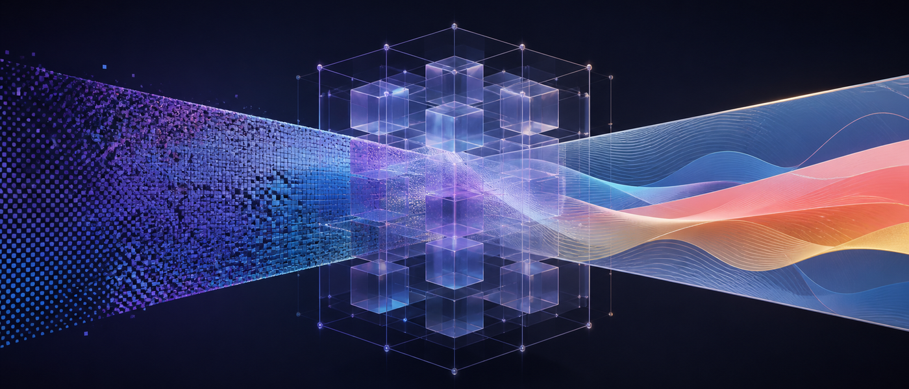
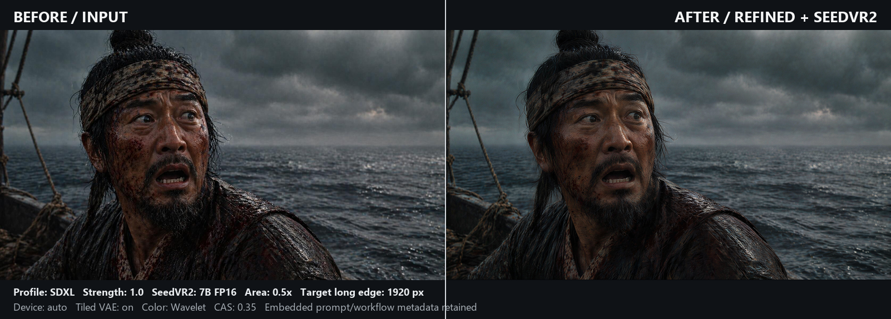
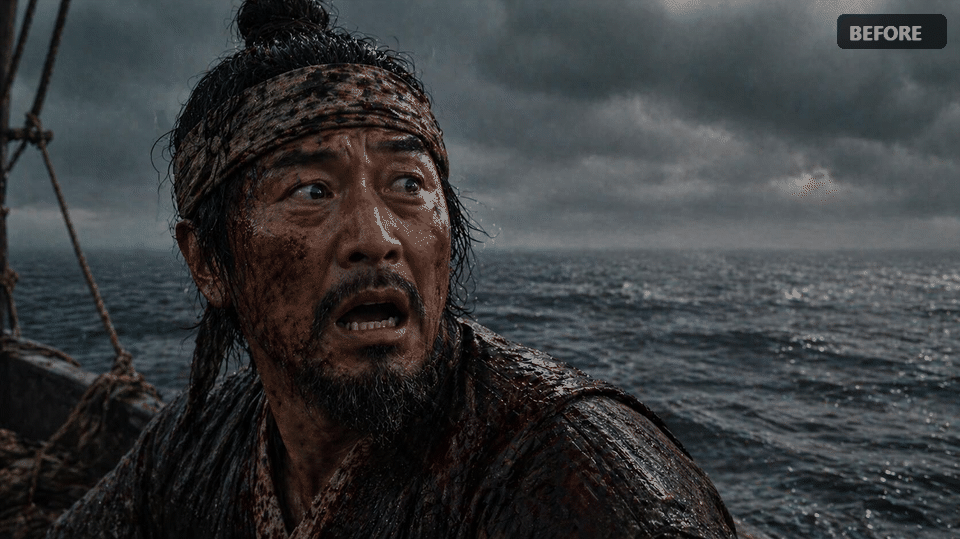
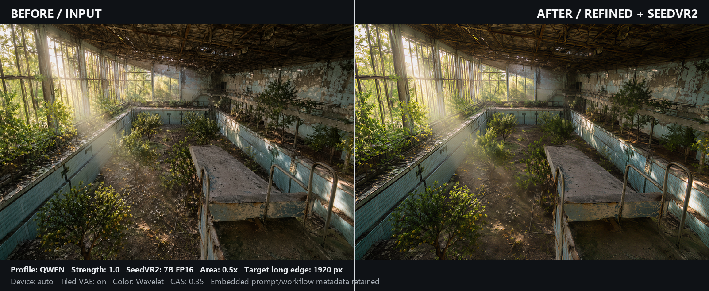
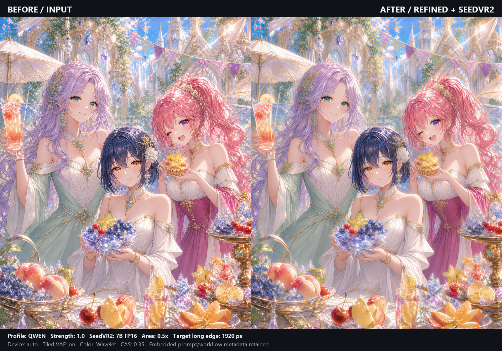
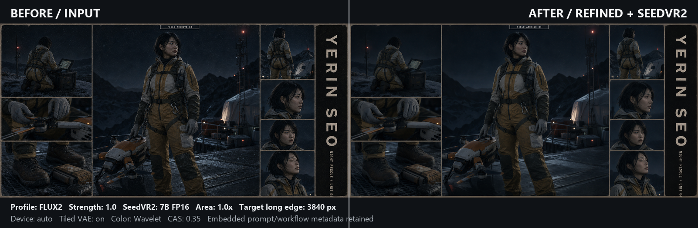
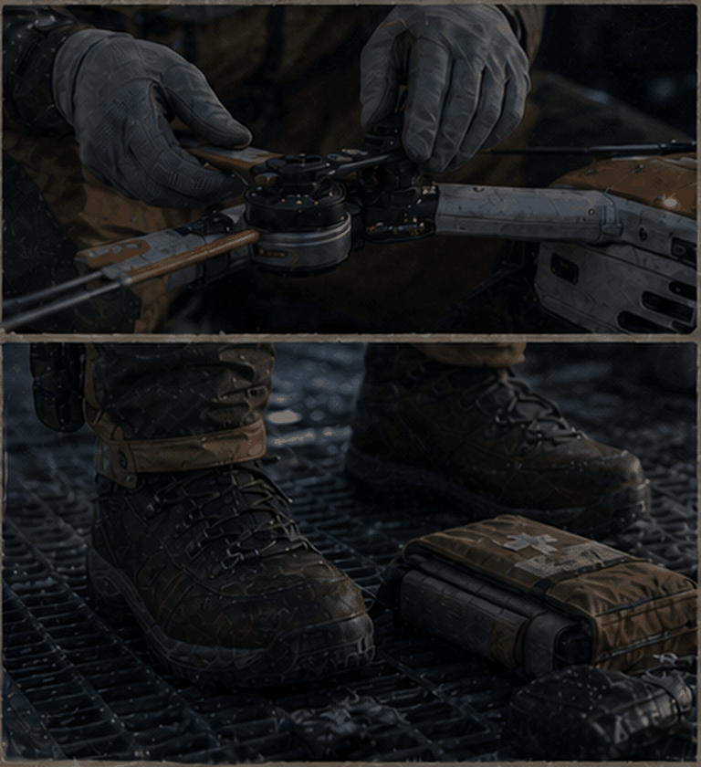

# ComfyUI GPT Image Latent Refiner



[](https://github.com/AIEGOBOT/ComfyUI-GPT-Image-Latent-Refiner/actions/workflows/ci.yml)

[English](README.md) | **한국어**

`GPT Image Latent Refiner`는 이미지를 새로 생성하는 도구가 아니라, GPT Image 계열
결과에서 반복적으로 나타나는 점 노이즈, 점묘, 때가 낀 듯한 질감과 타일 형태의 미세
텍스처를 줄이는 ComfyUI 후처리 노드입니다. OpenAI API 키가 필요 없으며 모델과
이미지를 모두 로컬에서 처리합니다.

## 핵심 특징과 주의사항

- 프로젝트에서 학습한 `qwen`, `flux2`, `sdxl` 리파이너 체크포인트 3개가 저장소에
  포함되며 노드가 자동으로 찾습니다. 별도 모델 다운로드가 필요하지 않습니다.
- Qwen Image, FLUX.2, SDXL의 제3자 VAE는 포함하지 않습니다. 각 공식 출처에서
  받아 정해진 폴더에 설치해야 합니다.
- 리파이너만 단독으로 사용할 수 있지만 변화가 비교적 미묘할 수 있습니다. 제작자
  테스트에서는 SeedVR2 앞의 전처리 단계로 사용할 때 효과가 훨씬 뚜렷했습니다.
- 원본 구도를 최대한 유지하도록 학습했지만 `strength`, 프로필, 입력 이미지에 따라
  실제 디테일도 바뀔 수 있습니다. 중요한 이미지에는 낮은 강도부터 비교하세요.
- 이 노드는 특정한 GPT Image 계열 아티팩트를 대상으로 하며 일반적인 노이즈 제거기나
  이미지 생성 모델을 대체하지 않습니다.

## 프로필

| 프로필 | 상태 | 용도와 특성 |
|---|---|---|
| `qwen` | 권장 기본값 | 노이즈 제거와 원본 보존의 균형이 가장 좋았던 프로필 |
| `flux2` | 안정적인 대안 | 정리 효과는 비교적 약하지만 원본 디테일을 더 많이 보존 |
| `sdxl` | 실사 인물 대안 | 재구성 변화가 강하지만 실사 인물 사진에서는 Qwen이나 FLUX.2보다 효과적일 수 있음 |

`strength`는 `0.0`부터 `2.0`까지 조절할 수 있습니다. `1.0`은 학습된 보정량을
그대로 적용하고, `0.0`은 실제 우회 동작이며, `1.0`을 넘으면 학습된 residual
보정량을 확대합니다.

## ComfyUI Manager로 설치

**ComfyUI Manager**를 열고 **GPT Image Latent Refiner**를 검색한 뒤
**Install**을 선택합니다. 설치가 끝나면 ComfyUI를 재시작합니다.

Manager 패키지에는 Qwen, FLUX.2, SDXL 리파이너 체크포인트가 포함됩니다. 제3자
VAE는 포함되지 않으므로 [필수 VAE와 설치 경로](#필수-vae와-설치-경로)에 따라
별도로 내려받아야 합니다.

## Windows 수동 설치

설치가 끝나면 ComfyUI를 다시 시작하세요. 아래 명령은 PowerShell 기준입니다.

### ComfyUI Portable

Portable 최상위 폴더에서 실행합니다. 저장소는 정확히
`ComfyUI_windows_portable/ComfyUI/custom_nodes/ComfyUI-GPT-Image-Latent-Refiner`
경로에 설치됩니다.

```powershell
Set-Location 'C:\ComfyUI_windows_portable'
git clone https://github.com/AIEGOBOT/ComfyUI-GPT-Image-Latent-Refiner.git '.\ComfyUI\custom_nodes\ComfyUI-GPT-Image-Latent-Refiner'
& '.\python_embeded\python.exe' -m pip install -r '.\ComfyUI\custom_nodes\ComfyUI-GPT-Image-Latent-Refiner\requirements.txt'
```

### ComfyUI Desktop

Desktop 애플리케이션 내부의 `resource\ComfyUI` 폴더에는 설치하지 마세요. 이 폴더는
Desktop이 직접 관리하며 업데이트할 때 내용이 초기화될 수 있습니다. Desktop 설치
과정에서 선택한 사용자 데이터 위치의 `custom_nodes` 폴더를 사용해야 합니다.

Desktop 하단 패널에서 내장 **Terminal**을 열고, 현재 위치에 `custom_nodes` 폴더가
있는지 확인한 뒤 다음 명령을 실행하세요. 내장 Terminal의 `python`은 Desktop이
사용하는 Python 환경을 가리키므로 의존성도 같은 환경에 설치됩니다.

```powershell
git clone https://github.com/AIEGOBOT/ComfyUI-GPT-Image-Latent-Refiner.git '.\custom_nodes\ComfyUI-GPT-Image-Latent-Refiner'
python -m pip install -r '.\custom_nodes\ComfyUI-GPT-Image-Latent-Refiner\requirements.txt'
```

### 일반 Windows venv 설치

ComfyUI에 `venv`를 직접 구성한 경우입니다.

```powershell
Set-Location '<ComfyUI>\custom_nodes'
git clone https://github.com/AIEGOBOT/ComfyUI-GPT-Image-Latent-Refiner.git
& '<ComfyUI>\venv\Scripts\python.exe' -m pip install -r '.\ComfyUI-GPT-Image-Latent-Refiner\requirements.txt'
```

## 필수 VAE와 설치 경로

세 리파이너 `model.pt`는 저장소에 포함되어 자동으로 로드됩니다. 추론에 필요한
제3자 VAE는 아래 공식 폴더에서 `config.json`과
`diffusion_pytorch_model.safetensors`를 각각 받아 파일 이름을 바꾸지 말고
설치해야 합니다.

| 프로필 | 공식 VAE 출처 | 설치 폴더 |
|---|---|---|
| `qwen` | [Qwen Image VAE](https://huggingface.co/Qwen/Qwen-Image/tree/main/vae) | `ComfyUI/models/vae/GPT-Image-Latent-Refiner/qwen/` |
| `flux2` | [FLUX.2 Small Decoder](https://huggingface.co/black-forest-labs/FLUX.2-small-decoder/tree/main) | `ComfyUI/models/vae/GPT-Image-Latent-Refiner/flux2/` |
| `sdxl` | [SDXL Base 1.0 VAE](https://huggingface.co/stabilityai/stable-diffusion-xl-base-1.0/tree/main/vae) | `ComfyUI/models/vae/GPT-Image-Latent-Refiner/sdxl/` |

최종 파일 구조는 다음과 같아야 합니다.

```text
ComfyUI/models/vae/GPT-Image-Latent-Refiner/qwen/config.json
ComfyUI/models/vae/GPT-Image-Latent-Refiner/qwen/diffusion_pytorch_model.safetensors
ComfyUI/models/vae/GPT-Image-Latent-Refiner/flux2/config.json
ComfyUI/models/vae/GPT-Image-Latent-Refiner/flux2/diffusion_pytorch_model.safetensors
ComfyUI/models/vae/GPT-Image-Latent-Refiner/sdxl/config.json
ComfyUI/models/vae/GPT-Image-Latent-Refiner/sdxl/diffusion_pytorch_model.safetensors
```

번들 체크포인트를 교체하려면 호환되는 `model.pt`를
`ComfyUI/models/gpt_image_latent_refiner/<profile>/model.pt`에 넣습니다. 외부
체크포인트가 번들 파일보다 우선합니다. 파일 크기와 SHA-256은
[models/README.ko.md](models/README.ko.md)와
[models/SHA256SUMS](models/SHA256SUMS)에서 확인할 수 있습니다. 노드는 선택한 프로필,
latent channel 수, 체크포인트 metadata와 VAE 파일이 서로 맞는지 확인하며,
호환되지 않는 파일을 조용히 섞어 실행하지 않습니다.

## 기본 사용법과 노드 설정

- 노드 ID: `indii.GPTImageLatentRefiner`
- 표시 이름: `GPT Image Latent Refiner`
- 카테고리: `GPT Image/refinement`
- 입력: `image`, `profile`, `strength`, `device`, `tile_vae`
- 출력: `image`

기본 흐름은 `Load Image -> GPT Image Latent Refiner -> Preview/Save Image`입니다.
처음에는 `qwen`, `strength=1.0`, `device=auto`, `tile_vae=true`로 시작하세요.

| 설정 | 설명 |
|---|---|
| `profile` | 입력 특성에 맞는 Qwen, FLUX.2 또는 SDXL latent 프로필 |
| `strength` | 학습된 residual 보정량. `0.0`은 우회, `1.0`은 기본 보정량 |
| `device` | `auto` 권장. 필요할 때 CUDA 또는 CPU를 명시 |
| `tile_vae` | 리파이너 내부 Diffusers VAE의 타일 인코드·디코드를 켜는 메모리 절약 옵션 |

CUDA에서는 네이티브 BF16 지원 여부를 먼저 확인하고 `BF16 -> FP16 -> FP32`
순으로 안전한 추론 dtype을 자동 선택합니다. CPU는 FP32를 사용합니다. Qwen VAE는
CUDA에서 선택된 dtype을 사용하고, FLUX.2와 SDXL VAE는 호환성을 위해 FP32를
유지합니다.

## VRAM과 VAE 타일링

### 리파이너 단독

프로필에 기록된 Qwen 약 `7.5 GiB`, FLUX.2·SDXL 약 `4.0 GiB` 값은 실행 전에
ComfyUI의 `model_management.free_memory()`에 전달하는 보수적인 free-memory
target입니다. 실제 VRAM을 그만큼 예약하는 값이나 측정된 최소 요구량이 아닙니다.
이미지 해상도, 배치 수, VAE 구현, 다른 로드 모델과 오프로딩 상태에 따라 사용량이
달라집니다. 큰 이미지는 먼저 배치 1장으로 실행하세요.

`tile_vae`는 이 리파이너 노드 안에서 사용하는 VAE만 타일로 처리합니다. 고해상도
입력이나 VAE 단계의 OOM을 피하려면 켜고, VRAM이 충분하면 끄는 편이 일반적으로 더
빠릅니다. 타일 처리는 메모리를 줄이는 대신 처리 시간이 늘고 드물게 경계 차이가
보일 수 있습니다.

### 리파이너 + SeedVR2

리파이너 단독 실행과 SeedVR2 결합 실행의 메모리 요구량은 크게 다릅니다. 특히
SeedVR2 7B FP16은 리파이너보다 훨씬 무거우며 목표 해상도와 오프로딩 설정의 영향을
크게 받습니다. VRAM이 부족하면 7B INT8 ConvRot을 대안으로 사용할 수 있습니다.
실제 사용량은 해상도, GPU, ComfyUI 메모리 오프로딩과 VAE 처리 방식에 따라
달라집니다. 먼저 큰 이미지 한 장만 시험하세요.

포함된 SeedVR2 예제는 SeedVR2 단계에서 일반 `VAEEncode`와 `VAEDecode`를
사용합니다. 이는 리파이너의 `tile_vae`와 별개의 단계입니다. SeedVR2 VAE 단계에서
메모리가 부족할 때만 ComfyUI의 타일 VAE 인코드·디코드 노드로 교체하세요.

## 전처리·후처리 비교 예제

각 비교 이미지의 **왼쪽**은 처리 전 입력이고 **오른쪽**은 전체 워크플로우를 거친
최종 결과입니다. 아래 결과는 리파이너 노드 단독 결과가 아니라 Refiner + SeedVR2
전체 워크플로우의 결과입니다.

SDXL 실사 인물과 도감의 크롭 디테일 두 곳에는 Image Comparer 방식의 움직이는
비교도 제공합니다. 각 GIF는 정적 비교 이미지 아래에 배치되며 처리 전 화면을 잠시
보여준 뒤 왼쪽부터 처리 후 결과를 공개하고, 마지막 최종 화면을 잠시 유지합니다.
SDXL 예제에는 Reddit 등에서 고화질로 볼 수 있도록 처리 전후 원본 이미지에서 직접
만든 전체 해상도 H.264 MP4도 함께 제공합니다.

공통 설정은 리파이너 `device=auto`, 리파이너 `tile_vae=true`, SeedVR2 7B FP16과
`ema_vae_fp16.safetensors`, 일반 `VAEEncode`·`VAEDecode`, Bicubic 목표 크기 조정,
Wavelet 색상 보정, CAS `0.35`입니다. 예제마다 달라지는 프로필과 해상도 설정은
다음과 같습니다.

| 예제 | 리파이너 프로필 | Strength | Area 사전 축소 | 목표 장변 |
|---|---:|---:|---:|---:|
| 실사 인물 | `sdxl` | `1.0` | `0.5배` | `1920 px` |
| 환경·건축 | `qwen` | `1.0` | `0.5배` | `1920 px` |
| 애니메이션 일러스트 | `qwen` | `1.0` | `0.5배` | `1920 px` |
| 야간 구조 도감 | `flux2` | `1.0` | `1.0배`(축소 없음) | `3840 px` |

### 실사 인물 — SDXL

**정적 좌우 비교**

[](assets/examples/example-01-photoreal-portrait-compare.png)

[처리 전](assets/examples/example-01-photoreal-portrait-before.jpg) ·
[처리 후](assets/examples/example-01-photoreal-portrait-after-sdxl.png)

**움직이는 좌우 비교**

[](assets/examples/example-01-photoreal-portrait-wipe.gif)

[고화질 1920×1078 MP4](assets/examples/example-01-photoreal-portrait-wipe-hq.mp4)

### 환경·건축 — Qwen

**정적 좌우 비교**

[](assets/examples/example-02-environment-compare.png)

[처리 전](assets/examples/example-02-environment-before.png) ·
[처리 후](assets/examples/example-02-environment-after-qwen.png)

### 애니메이션 일러스트 — Qwen

**정적 좌우 비교**

[](assets/examples/example-03-anime-compare.png)

[처리 전](assets/examples/example-03-anime-before.png) ·
[처리 후](assets/examples/example-03-anime-after-qwen.png)

### 야간 구조 도감 — FLUX.2

**정적 좌우 비교**

[](assets/examples/example-04-night-rescue-compare.png)

[처리 전](assets/examples/example-04-night-rescue-before.png) ·
[처리 후](assets/examples/example-04-night-rescue-after-flux2.png)

**크롭 애니메이션 상세 비교**

| 손·장비 및 부츠 | 얼굴 아래 신체 디테일 |
|:---:|:---:|
| [](assets/examples/example-04-night-rescue-hands-boots-wipe.gif) | [](assets/examples/example-04-night-rescue-body-wipe.gif) |

새 이름의 처리 전·후 파일은 원본을 바이트 단위로 그대로 복사했으므로 기존 내장
메타데이터가 유지됩니다. 각 비교 PNG에도 처리 후 이미지의 ComfyUI `prompt`와
`workflow` 필드 및 별도의 `comparison_manifest` 필드를 넣었습니다. 정확한 설정과
GIF 애니메이션 값, 해상도, SHA-256 해시는
[assets/examples/metadata.json](assets/examples/metadata.json)에 기록했습니다.

## 권장 SeedVR2 워크플로우

리파이너를 단독으로 사용할 수도 있지만, 제작자 테스트에서는 SeedVR2 앞에 배치했을
때 효과가 가장 뚜렷했습니다. 반복 점무늬와 불안정한 미세 질감을 먼저 정리해
SeedVR2가 이를 이미지 디테일로 재구성하거나 확대할 가능성을 줄입니다.

포함된
[GPT Image Refiner + SeedVR2 워크플로우](example_workflows/GPT_Image_Refiner_SeedVR2.json)는
다음 순서로 처리합니다.

```text
입력 -> GPT Image Latent Refiner -> Area 0.5배 축소 -> 목표 크기 조정
     -> SeedVR2 복원 -> Wavelet 색상 보정 -> CAS -> 최종 출력
```

Bicubic 노드가 목표 픽셀 해상도를 먼저 정하고, SeedVR2가 그 크기에서 이미지를
재구성하고 복원합니다. 예제 JSON은 SeedVR2 VAE에 일반 `VAEEncode`와
`VAEDecode`를 사용합니다. SeedVR2 VAE 단계에서 OOM이 발생하면 두 노드를 ComfyUI의
타일 VAE 버전으로 교체할 수 있지만, 리파이너 노드의 `tile_vae` 스위치와는 서로
독립적입니다.

`0.5배` 축소는 의도적으로 넣은 단계지만 필수는 아닙니다. Area 축소가 불안정한
고주파 패턴을 평균화한 뒤 SeedVR2가 이미지를 다시 구성하므로 점 노이즈나 격자
질감이 디테일로 보존될 가능성을 줄일 수 있습니다. 반대로 실제 미세 디테일이나 작은
글자도 사라질 수 있으므로 원본 보존이 더 중요하면 배율을 `1.0`으로 바꾸거나 해당
노드를 우회하세요.

### SeedVR2 모델과 의존성

예제는 리파이너 `qwen` 프로필과 SeedVR2 7B FP16을 사용합니다.

- **권장:** 이 워크플로우에서 확인한 품질과 아티팩트 억제 효과가 가장 좋은
  SeedVR2 7B FP16
- **VRAM 부족 시 대안:** `seedvr2_7b_int8_convrot.safetensors`. 7B 구조를
  유지하면서 메모리 사용량을 줄일 수 있지만 FP16보다 품질이 낮아질 수 있음
- **주의:** 3B 또는 더 강하게 양자화된 모델은 아티팩트를 다시 드러내거나 강조할
  수 있음. 이는 모든 이미지에 적용되는 절대 기준이 아니라 이 워크플로우에서 관찰한
  경향임

| 파일 | 출처·상태 | 설치 위치 |
|---|---|---|
| Qwen, FLUX.2, SDXL 리파이너 `model.pt` | 저장소에 포함된 프로젝트 학습 체크포인트; 자동 로드 | 이 저장소의 `models/gpt_image_latent_refiner/<profile>/model.pt` |
| SeedVR2 7B FP16 | [다운로드](https://huggingface.co/Comfy-Org/SeedVR2/resolve/main/diffusion_models/seedvr2_7b_fp16.safetensors) | `ComfyUI/models/diffusion_models/` |
| SeedVR2 7B INT8 ConvRot | [다운로드](https://huggingface.co/Comfy-Org/SeedVR2/resolve/main/diffusion_models/seedvr2_7b_int8_convrot.safetensors) | `ComfyUI/models/diffusion_models/` |
| SeedVR2 VAE FP16 | [다운로드](https://huggingface.co/Comfy-Org/SeedVR2/resolve/main/vae/ema_vae_fp16.safetensors) | `ComfyUI/models/vae/` |

SeedVR2 자체는 예제에서
[ComfyUI 네이티브 노드](https://docs.comfy.org/tutorials/utility/seedvr2)를
사용합니다. 해당 노드가 보이지 않으면 ComfyUI를 업데이트하세요. 배포된 그래프에는
다음 노드 팩도 사용됩니다.

| 노드 팩 | 사용 노드 | 용도 |
|---|---|---|
| [ComfyUI Essentials](https://github.com/cubiq/ComfyUI_essentials) | `ImageCASharpening+` | 마지막 CAS 선명도 보정 |
| [ComfyUI-Easy-Use](https://github.com/yolain/ComfyUI-Easy-Use) | `easy cleanGpuUsed`, `easy clearCacheAll` | 무거운 단계 사이 GPU 메모리·캐시 정리 |
| [rgthree-comfy](https://github.com/rgthree/rgthree-comfy) | `Image Comparer (rgthree)` | 대화형 결과 비교; 비교 노드를 제거하면 생략 가능 |

### Hires Fix·latent upscale과의 차이

| | 일반적인 Hires Fix / latent upscale | 이 SeedVR2 워크플로우 |
|---|---|---|
| 주목적 | 더 큰 해상도에서 diffusion 생성을 이어감 | 반복 아티팩트를 제거한 뒤 목표 크기에서 복원함 |
| 처리 방식 | 이미지 또는 latent를 키운 뒤 두 번째 diffusion sampling 수행 | Latent 정제, 선택형 축소, 목표 크기 조정, 한 단계 SeedVR2 복원 |
| 재구성 강도가 약할 때 | 기존 아티팩트와 흐림이 남은 채 커질 수 있음 | 복원 전에 리파이너가 문제 질감을 먼저 줄임 |
| 재구성 강도가 강할 때 | 얼굴, 정체성, 글자, 구도 또는 형태가 달라질 수 있음 | SeedVR2도 디테일을 바꿀 수 있지만 복원 단계로 조건화해 사용함 |
| 적합한 목적 | 프롬프트 기반 디테일 확장과 생성의 연장 | 기존 이미지의 아티팩트 정리와 재구성 |

Hires Fix 자체가 더 나쁜 방식은 아니며 목적이 다릅니다. 아티팩트 정리에서는 denoise가
약하면 문제 질감까지 남고, 강하면 이미지가 지나치게 다시 구성될 수 있습니다. 이
워크플로우는 정리와 재구성을 분리해 두 역할을 더 쉽게 제어합니다.

[SeedVR2 워크플로우 상세 설명](docs/SEEDVR2_WORKFLOW.ko.md)에는 각 단계의 역할과
메모리 선택지를 더 자세히 정리했습니다.

## 출처·제3자 구성요소·라이선스

### 출처와 저장소 범위

이 프로젝트는 Larryvrh의
[GPT Image 2 Artifact Cleaner](https://github.com/Larryvrh/gpt-image-2-artifact-cleaner)와
그 프로젝트가 사용한 latent-residual 방식에서 아이디어를 얻었습니다. 이 저장소의
refiner 체크포인트는 별도로 수집하고 정리한 아티팩트/클린 이미지 75쌍을 사용해
독립적으로 학습했습니다. 원본 프로젝트의 체크포인트는 포함하거나 재배포하지
않습니다.

원본 프로젝트는 FLUX.2 VAE 기반 파이프라인을 사용합니다. 이 프로젝트는 그 접근을
ComfyUI 네이티브 노드로 구성하고 Qwen Image, FLUX.2, SDXL VAE에 맞춰 별도로
학습한 세 프로필을 제공합니다. 원본 프로젝트에는 별도의
[PolyForm Noncommercial License 1.0.0](https://github.com/Larryvrh/gpt-image-2-artifact-cleaner/blob/main/LICENSE)이
적용됩니다. 이 저장소에 포함된 세 `model.pt`는 EMA residual 가중치와 체크포인트
metadata를 담은 추론용 배포본이며 학습 optimizer 상태는 포함하지 않습니다.

저장소에는 ComfyUI 실행 코드, 프로젝트에서 학습한 추론용 체크포인트 3개, 의존성
metadata, 이동 가능한 예제 워크플로우와 위의 공개용 전처리·후처리 예제 4쌍을
포함합니다. 학습 코드, 전체 학습 데이터셋, 제3자 VAE 가중치, 그 밖의 생성 이미지와
비공개 실험 기록은 포함하지 않습니다.

### 제3자 구성요소

VAE 가중치와 SeedVR2는 이 저장소와 프로젝트 라이선스에 포함되지 않습니다. 각 공식
출처에서 별도로 받고 해당 라이선스를 따라야 합니다.

- [Qwen Image VAE](https://huggingface.co/Qwen/Qwen-Image/tree/main/vae) — Apache License 2.0
- [FLUX.2 Small Decoder](https://huggingface.co/black-forest-labs/FLUX.2-small-decoder/tree/main) — Apache License 2.0
- [Stable Diffusion XL Base 1.0 VAE](https://huggingface.co/stabilityai/stable-diffusion-xl-base-1.0/tree/main/vae) — CreativeML Open RAIL++-M
- [ByteDance SeedVR2](https://github.com/ByteDance-Seed/SeedVR) — Apache License 2.0

전체 출처와 배포 범위는
[THIRD_PARTY_NOTICES.ko.md](THIRD_PARTY_NOTICES.ko.md)에서 확인할 수 있습니다.

### 라이선스

별도 표시가 없는 한 이 저장소의 코드와 이 프로젝트가 공개하는 residual 체크포인트에는
[PolyForm Noncommercial License 1.0.0](LICENSE)이 적용됩니다. 해당 라이선스가
허용하는 비상업적 목적에 한해 사용, 수정 및 공유할 수 있습니다. 상업적 사용 권한은
부여되지 않습니다.

75쌍의 학습 데이터셋과 원본 이미지, 제3자 VAE 가중치 및 원본 GPT Image 2
Artifact Cleaner 체크포인트는 이 저장소에서 배포하지 않습니다. 프로젝트 출처는
[NOTICE.ko.md](NOTICE.ko.md)를 참고하세요.

### 문서 언어 정책

이 프로젝트의 사용자 대상 문서는 영문과 한글을 함께 관리합니다. 법률 문서의 번역이
다를 경우 영문 법률 파일과 각 상위 프로젝트가 공개한 공식 라이선스 원문을 기준으로
합니다.
